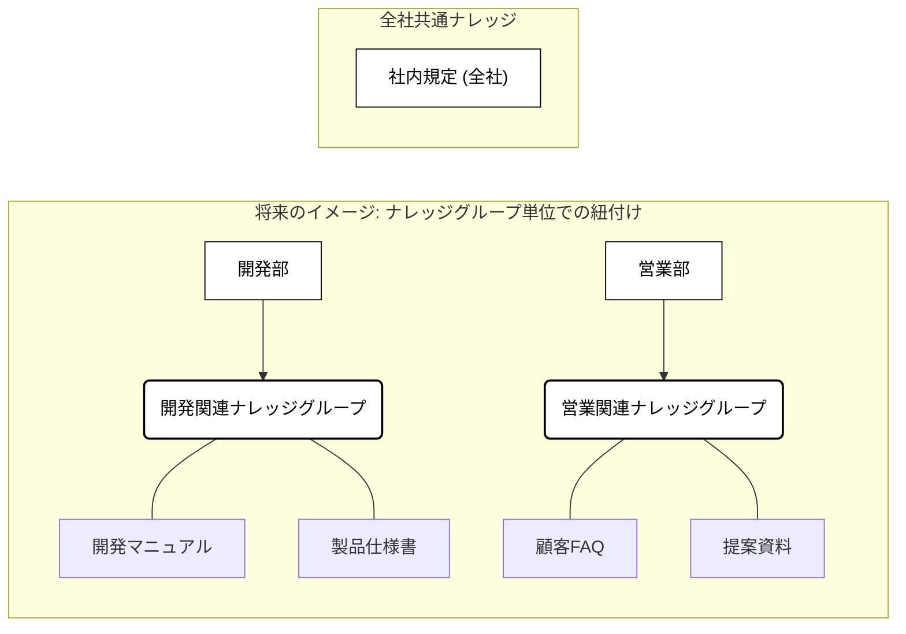
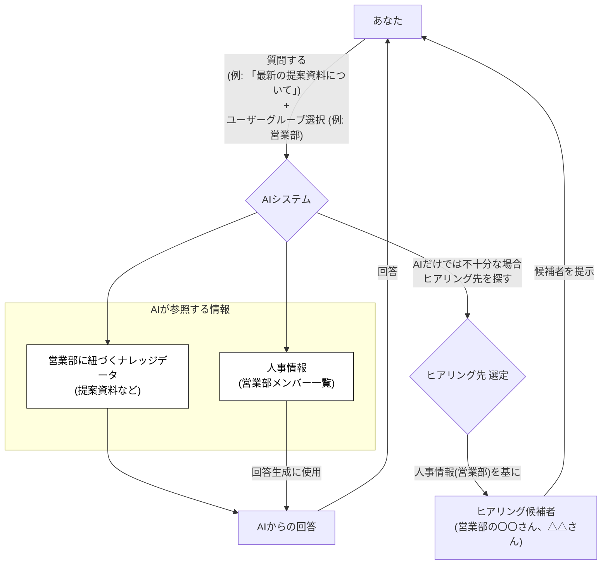

# ナレッジグループ機能について

## 1. ナレッジグループとは？

この機能は、社内のたくさんの情報（＝ナレッジデータ）を、関連する部署やチーム（＝ユーザーグループ）ごとに整理し、**「必要な人が、必要な情報に、必要な時に」** スムーズにアクセスできるようにするための仕組みである。

この機能を使うことで、AIへの質問がより的確になったり、質問に関連する詳しい人（ヒアリング先）を効率的に見つけたりすることが可能となる。

## 2. キーワード

この機能を理解するために、いくつかのキーワードを押さえておく。

- **ユーザーグループ**:
  - あなたの所属部署や、参加しているプロジェクトチームなどをイメージする。（例: 開発部、営業部、役員、〇〇プロジェクトチーム）
  - 一人の従業員が、複数のユーザーグループに所属することも可能である。（例: 開発部のメンバーであり、〇〇プロジェクトチームのメンバーでもある）
- **ナレッジデータ**:
  - 社内に蓄積されている様々な情報や資料のことである。（例: 社内マニュアル、会議の議事録、よくある質問とその回答集(FAQ)など）
- **ナレッジグループ**: （※将来的に導入予定の考え方である）
  - 関連性の高いナレッジデータをひとまとめにしたグループである。
  - 現在はナレッジデータ一つひとつにユーザーグループを紐づけているが、将来はこの「ナレッジグループ」単位でユーザーグループを紐づけることで、管理がしやすくなる予定である。
- **人事情報**:
  - 「誰がどのユーザーグループ（部署・チーム）に所属しているか」という情報である。この機能と連動している。

## 3. 情報（ナレッジ）の整理とアクセスについて

この機能の核心は、情報（ナレッジデータ）と人（ユーザーグループ）を結びつける点にある。

- **基本的な考え方**: ナレッジデータは、特定の「ユーザーグループ」に関連付けることができる。
- **現状**: ナレッジデータ一つひとつに対して、「これは〇〇部の情報」というように、ユーザーグループを1つだけ紐づけることができる。
- **将来の予定**: 今後、管理の手間を減らすために、複数のナレッジデータをまとめた「ナレッジグループ」を作り、そのグループに対してユーザーグループを紐づける方式に変更する予定である。これにより、「この資料群は△△部のもの」といった、より大きな単位での管理が可能になる。
- **「全社」の情報**: どのユーザーグループにも紐づけられていないナレッジデータは、**全従業員がアクセスできる「全社共通の情報」**として扱われる。

下の図は、将来の「ナレッジグループ」を使った場合のイメージである。

**(図の説明)** 開発部は「開発関連ナレッジグループ」に、営業部は「営業関連ナレッジグループ」に紐づいています。各ナレッジグループには、関連するナレッジデータが含まれます。「社内規定」のように、どのグループにも属さないものは全社共通となります。

## 4. 人事情報とのつながり

「誰がどのユーザーグループに所属しているか」という人事情報は、このシステムと連動している。これにより、後述するAIへの質問の際に、適切な情報源を参照したり、適切なヒアリング相手を見つけたりすることが可能になる。

## 5. AIに質問するときの流れ

AIに質問する際には、**「どのユーザーグループに関連する質問か」** を選択する。これにより、AIはより的確な回答を探し出すことができる。

1.  **質問とグループ選択**: あなたがAIに質問する際、「これは営業部の業務に関する質問である」というように、関連する「ユーザーグループ」を選択する。
2.  **AIが情報を探す**: AIは、あなたが選択した「ユーザーグループ」（例: 営業部）に紐づいているナレッジデータ（将来的にはナレッジグループ）**のみ**を参照して回答を考える。もしユーザーグループを選択せずに質問した場合は、「全社」のナレッジデータを参照する。
3.  **適切な人に聞く（ヒアリング）**: もしAIだけでは答えが見つからない場合や、より詳しい情報が必要な場合、AIは質問時に選択された「ユーザーグループ」（例: 営業部）に所属している従業員の中から、**人事情報に基づいて**適切なヒアリング候補者を探し出して提案する。

以下の図は、質問から回答、そしてヒアリングまでの流れを示す。

**(図の説明)** あなたが「営業部」を選択して質問すると、AIは「営業部のナレッジ」と「人事情報（営業部）」を参照する。AIは回答を生成し、必要であれば人事情報を基に営業部のメンバーからヒアリング候補者を選んで提示する。

## 6. まとめ

このナレッジグループ機能（および関連するユーザーグループ、人事情報連携）によって、

- 社内の情報が整理され、**探しやすくなる**。
- AIが質問の意図をより理解し、**的確な回答**を返しやすくなる。
- 質問内容に合わせて、**適切な部署や担当者にスムーズに相談（ヒアリング）**できるようになる。

これにより、社内の知識活用が促進され、業務効率の向上が期待できる。
